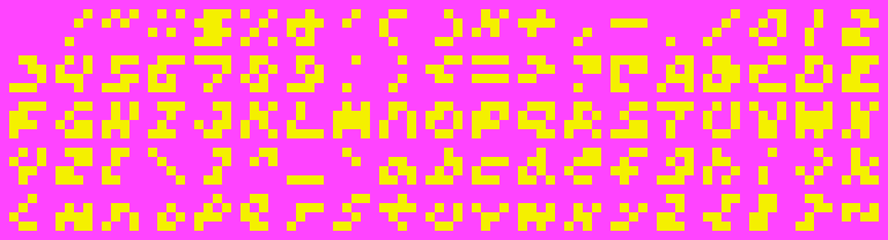

441 is a 4x4 pixel font with 1-bit color. 

The characters are arranged in ASCII-order:

     !"#$%&'()*+,-./012
    3456789:;<=>?@ABCDE
    FGHIJKLMNOPQRSTUVWX
    YZ[\]^_`abcdefghijk
    lmnopqrstuvwxyz{|}~
